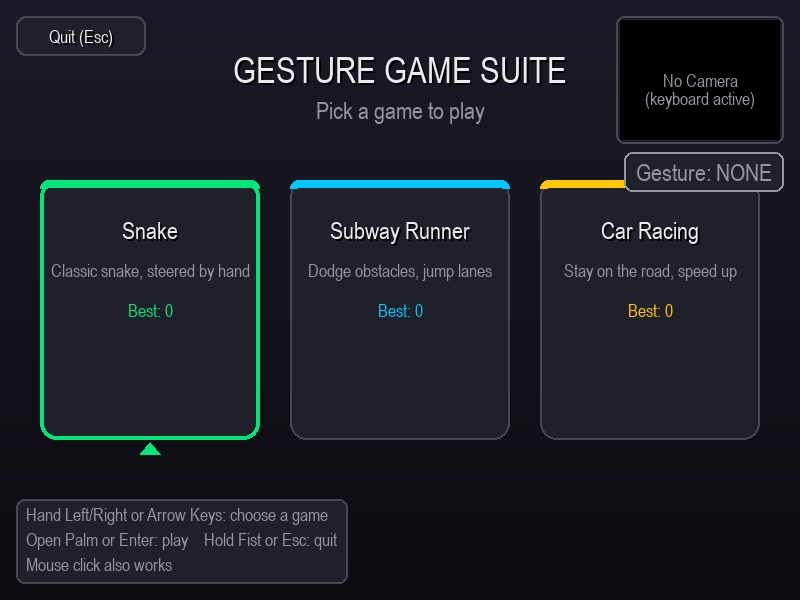
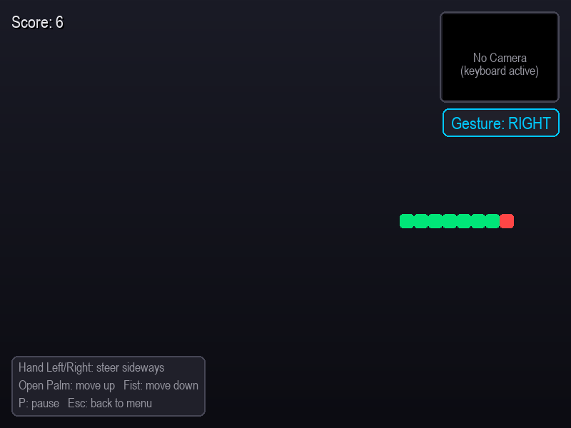

# Gesture Controlled Game Suite

Play three classic arcade games using hand gestures captured from a webcam — no keyboard required (though one always works as a fallback).

Built with Python, OpenCV, MediaPipe, and Pygame. A single graphical hub lets you pick between Snake, Subway Runner, and Car Racing.

## Screenshots
| Hub | Snake |
|---|---|
|  |  |

## Features
- Graphical hub — pick a game with the mouse, arrow keys, or hand gestures
- Live camera preview and gesture indicator shown on every screen
- Full keyboard fallback (arrow keys, space, down) if no webcam is available
- Local high scores saved automatically per game
- Pause, restart, and quit flows built into every game

## Quick Start
Requires Python 3.10+.

```bash
pip install -r requirements.txt
python main.py
```

A webcam is optional — the keyboard fallback is always active.

## Controls
| Action                     | Gesture                    | Keyboard          |
|-----------------------------|-----------------------------|--------------------|
| Steer / move left            | Hand held left of center    | Left arrow         |
| Steer / move right           | Hand held right of center   | Right arrow        |
| Start / jump / accelerate     | Open palm                   | Up arrow or Space  |
| Move down / go back          | Closed fist                 | Down arrow         |
| Pause (Snake only)           | -                            | P                  |
| Back to hub menu             | -                            | Esc                |

Holding a closed fist at the hub for one second quits the app; a progress bar shows the countdown so it's never accidental.

## How gesture detection works
Each frame, [MediaPipe Hands](https://developers.google.com/mediapipe/solutions/vision/hand_landmarker) locates 21 hand landmarks. Horizontal wrist position decides left/right, and whether the fingertips are curled below their middle joints decides open palm vs. fist. A short rolling majority vote smooths out single-frame misreads.

## Project structure
```
main.py                 Graphical hub / launcher
gesture_controller.py   Webcam + MediaPipe gesture recognizer
config.py               Shared constants and color theme
ui.py                    Shared UI widgets (buttons, HUD, overlays, high scores)
snake_game.py            Snake
subway_runner.py         Subway Runner
car_racing.py            Car Racing
requirements.txt
```

## Tech stack
- [OpenCV](https://opencv.org/) - webcam capture and image processing
- [MediaPipe](https://developers.google.com/mediapipe) - hand landmark tracking
- [Pygame](https://www.pygame.org/) - rendering and game loop
